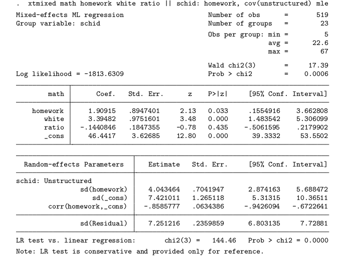
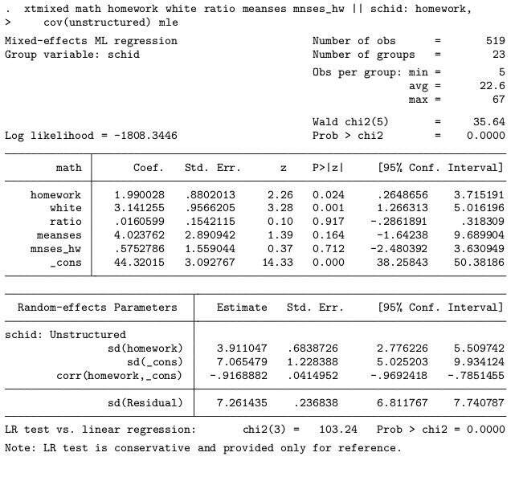

# Load libraries

```{r}
library(foreign)
library(lme4)
```
    
# Data import

```{r}
fn <- "gcse"
if (!file.exists(paste0(fn, ".dta12"))) {
    download.file(paste0("http://www.stata-press.com/data/mlmus3/", fn, ".dta"),
                  destfile = paste0(fn, ".dta12"))
}
```

```{r}
homework <- read.dta("homework.dta12") 
```

```{r}
rockchalk::summarize(homework)
```


# 4.3.1: write out the model

\[
 math_{ji} = (\beta_0 + \beta_{0j}) + (\beta_{1} + b_{1j}) homework_{ji} + \beta_{2} white_{ji} + \beta_{3} ratio_{j} + \epsilon_{ji}
\]

or

\[
 math_{ji} = \beta_0 + \beta_{1} homework_ji + \beta_{2} white_ji + \beta_{3} ratio_{j} + \beta_{0j} + b_{1j} homework_{ji} + \epsilon_{ji}
\]

Would I want to re-name all the variables as $y_{ji}$ and $x1_{ji}$ or similar? 

The model assumes that 

### The random effects are correlated, bivariate normal.

\[
(b_{0j}, b_{1j}) \sim MVN(0, \Sigma_{b})
\]


### $\epsilon_{ji}$ is normal.

he expected value of epsilon is 0:

\[
\epsilon_{ji} \sim N(0, \Sigma_{\epsilon})
\]

It is actually a stronger assumption, if the $b_{0j}$ and $b_{1j}$
were know first, then

\[
\epsilon_{ji} b_{0j},b_{1j} = \sim N(0, \Sigma_{\epsilon})
\]


I am consciously refusing to spawn new symbols for variance
matrices. For me, all variance matrices are $\Sigma$


# 04.3 2

```{r}
m1 <- lmer(math ~ homework + white + ratio + (homework | schid),
           data = homework, REML = FALSE)
summary(m1) 
```


### Compare that to the stata output

I'll put in an image of stata output




### Inspect the estimated random effects:

```{r}
ranef(m1)
```

```{r}
m1.vc <- ranef(m1, condVar = TRUE)
library(lattice)
dotplot(m1.vc)
```

### Compare those to the estimated sigma! ?

```{r}
m1.vc.intercept <- m1.vc[["schid"]][ , "(Intercept)"]
sd(m1.vc.intercept)
m1.vc.homework <- m1.vc[["schid"]][ , "homework"]
sd(m1.vc.homework)
````
```{r}
VarCorr(m1)
```
I want the variance-covariance matrix. Reading `?VarCorr` I try this

```{r}
m1.varcorr <- VarCorr(m1)
print(m1.varcorr, comp = c("Variance"))
```

Then

```{r}
as.data.frame(m1.varcorr)
```

### Visualize

What do you want?

I want spaghetti plot!

Could also have lattice plot


### 4.3 3 variance of math conditional on covariates

\[
\widehat{Var(math_{ji})}=Var(\beta_0 + \beta_{1} homework_ji + \beta_{2} white_ji + \beta_{3} ratio_ji + b_{0j} + b_{1j} homework_{ji} + \epsilon_{ji})
\]

\[
\widehat{Var(math_{ji})}=Var(b_{0j} + b_{1j} homework_{ji} + \epsilon_{ji})
\]

We throw out everything that does not have random variance at the $j$
level or the error term.

### Math reminder

The general rule for constants $k_1$ and $k_2$ and random
variables $Z1$ and $Z2$

\[
Var(k_1 Z1 + k_2 Z2) = k_{1}^{2} Var(Z1) + k_{2} Var(Z2) + 2 k_1 k_2 Cov(Z1,Z2) 
\]

## Application

In our context, That's how we calculate $Var(b_{0j} + b_{1_j} homework_{ji})$

   * Z1 = random effect for intercept, $b_{0j}$
   * Z2 = random effect for slope, $b_{1j}$
   * Var(b_0) is estimated in the output: 55.07
   * Var(b_1) is estimated as: 16.349
   * Cov(b0, b1) is estimated as: -25.76
   * $k_1$ = 1
   * $k_2$ = homework_{ji} 
   
### Write out the variance of the parts with random effects

\[
Var(b_{0j} + homework_{ji} b_{1j}) =
  Var(b_{0j}) + homework_{ji}^2 Var(b_{1j}) + 2 homework_{ji} Cov(b_{0j}, b_{1j})
\]


### Oops, epsilon is needed too

I still need to add $Var(\epsilon_{ji})$ for which the estimate was 52.56

\[
\widehat{Var(math_{ji})}= 55.07 + 16.349 homework_{ji}^2  +
2\times(-25.76)\times homework_{ji} + 52.56
\]


# 4.3 4

Level 1 model:

\[
math_{ji} = \beta_0^* + \beta_1^* homework_{ji} + \beta_2^*white_{ji} + \epsilon_{ji}
\]

and at level 2 we have 2 models, 

\[
beta_0^* = \beta_1 + \beta_4 ratio_j + \beta_5 sesmean_j + b_{0j}
\]


\[
\beta_1^* = \beta_3 + \beta_6 sesmean_j + b_{1j}
\]

\[
math_{ji} = (put in \beta_0^*) + 
(put in \beta_1^*) homework_{ji} + \beta_2^*white_{ji} + \epsilon_{ji}
\]

And what do you get?

# Fit that

## Use lmer

```{r}
m2 <- lmer(math ~ homework + white + ratio + meanses*homework + (homework | schid),
           data = homework, REML = FALSE)
summary(m2) 
```


## Compare to stata


